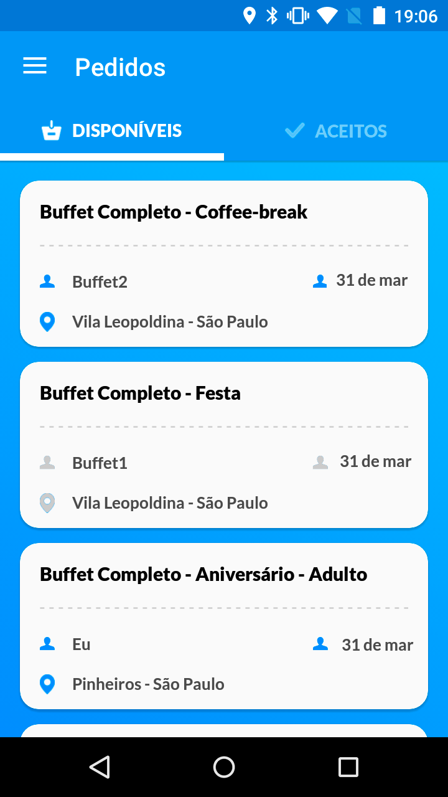
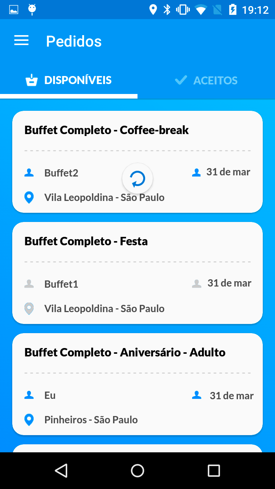
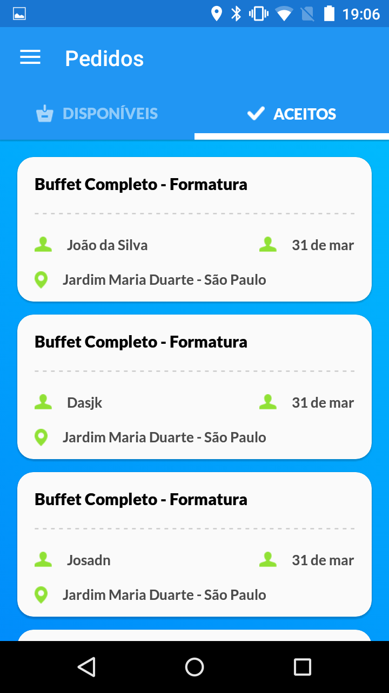
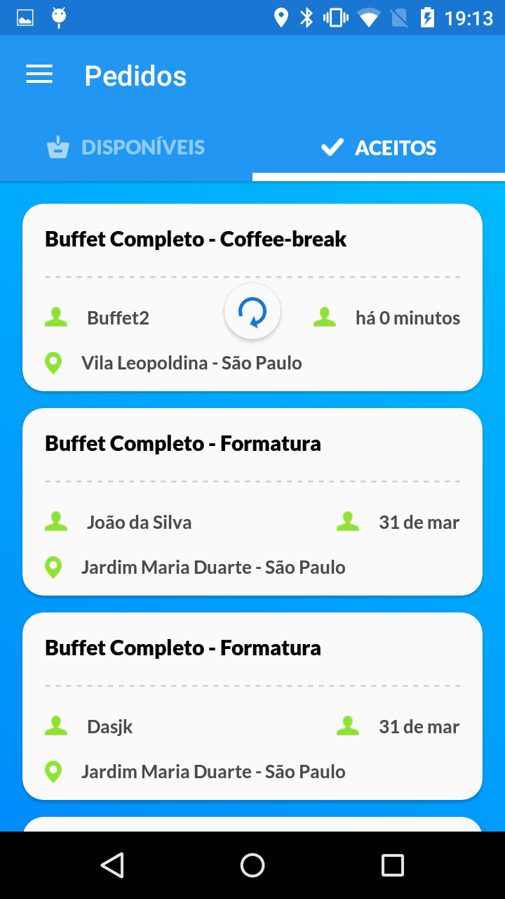
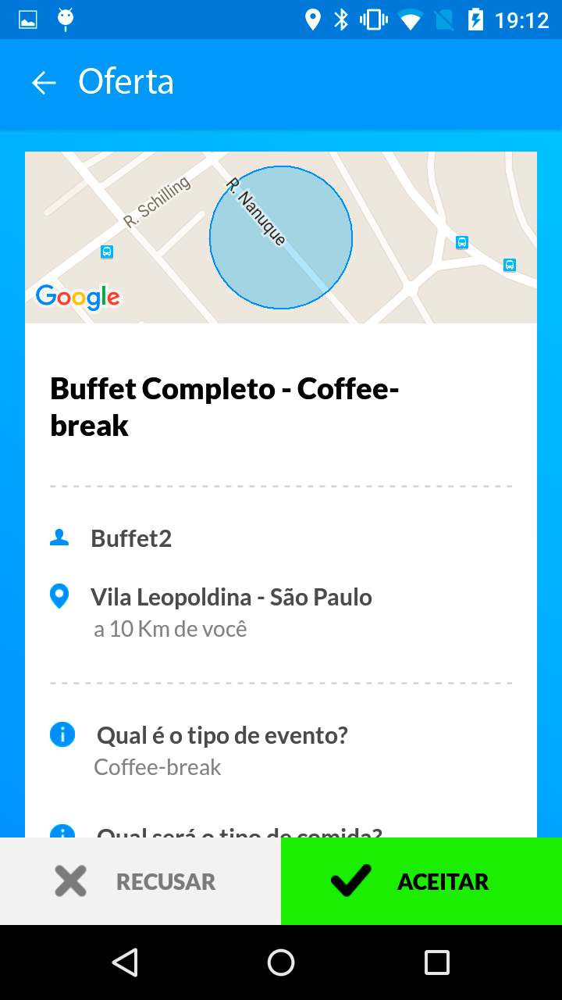
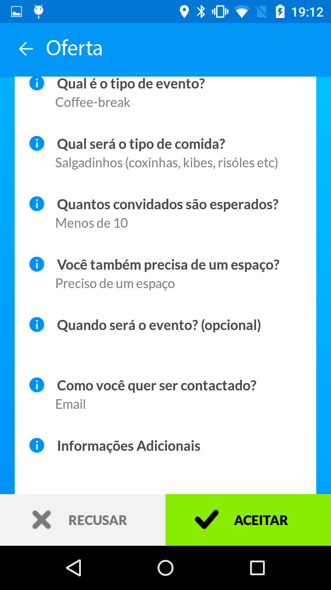
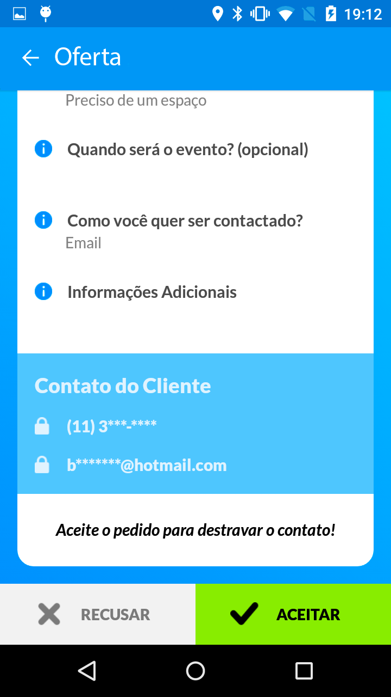
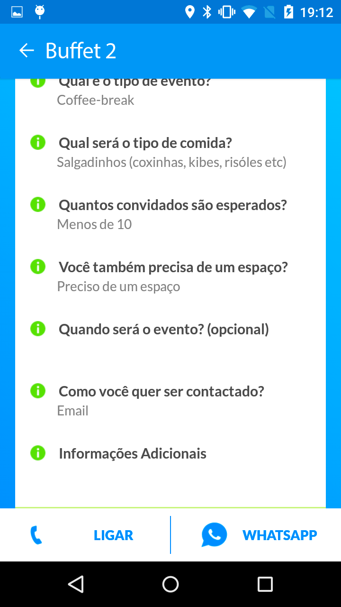
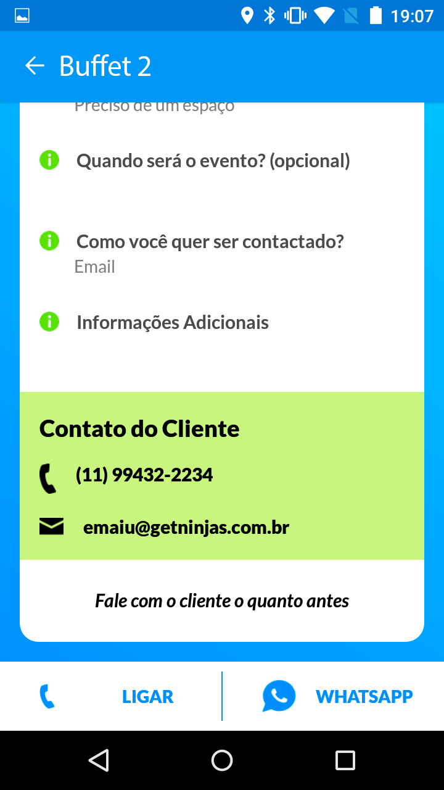

# GetNinjas Mobile Test

## The problem

Here at GetNinjas we have a list of job `offers`, which a pro can accept or
reject.

When an `offer` is accepted, it becomes a `lead`. The main difference between a
`lead` and an `offer` is that a `lead` has customer contacts, and `offer` does
not.

You'll design both the `leads` and `offers` list and details screen.

There's no need to implement the icons present in the screens.

## Rest API

We use a REST API, in which the client only knows one URI, the entrypoint. Each
other needed URI will be consumed from the JSON responses.

Here's the entrypoint URI: http://testemobile.getninjas.com.br

### Entrypoint

It's the only URI your application needs to know.

It has a `_links` entry, pointing to the `offers` and `leads` list.

[JSON example](json/index.json)

### Offers list

It lists every available `offer`. They have two statuses: `read` and `unread`.

You'll need to differentiate each status, using blue circle to an `unread` offer,
and `gray` to a `read` offer. You don't need to use the icons, a circle is OK.

Every `offer` has a link to the `offer` details.

You'll use the `self` link to implement "pull to refresh".

[JSON example](json/offers)

### Leads list

It lists every available `lead`.

Every `lead` has a link to the `lead` details.

You'll use the `self` link to implement "pull to refresh".

[JSON example](json/leads)

### Offer details

Shows the details for an offer.

Every `offer` has two links: one for the `accept` button, another to the
`reject` one.

[JSON example](json/offer-1)

### Lead details

Shows the detail for a lead.

In the screen, there's two buttons: one for "call" and another for "whatsapp".
You must implement both, leading the user to the phone and the whatsapp app
respectively.

[JSON example](json/lead-1)

## Screens

### Offers list

### Leads list

### Offer details

### Lead details

